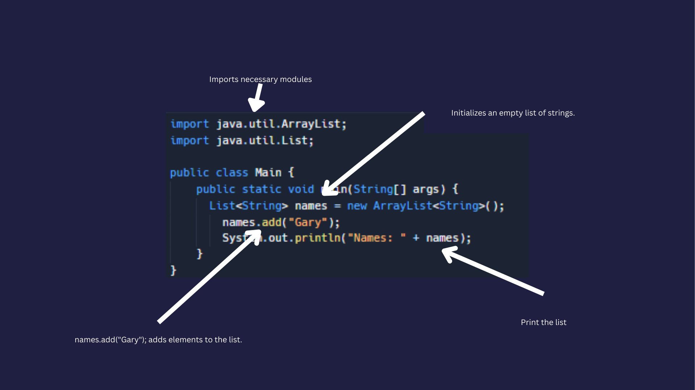

# Lists

List is like variable tjat store a collection of information

Try it out: 

👉 Copy this code into your coding editor in `Main.java` and see what happens when you hit `run`:



```java
import java.util.ArrayList;
import java.util.List;

public class Main {
    public static void main(String[] args) {
      
      List<String> names = new ArrayList<String>(); //Create the list of String Called names

        // Add strings to the list
        names.add("Gary");
        names.add("Bob");
        names.add("Joe");

        // Print the list
        System.out.println("Names: " + names);

        // Access an part of the specific index
        String name2 = names.get(1);
```