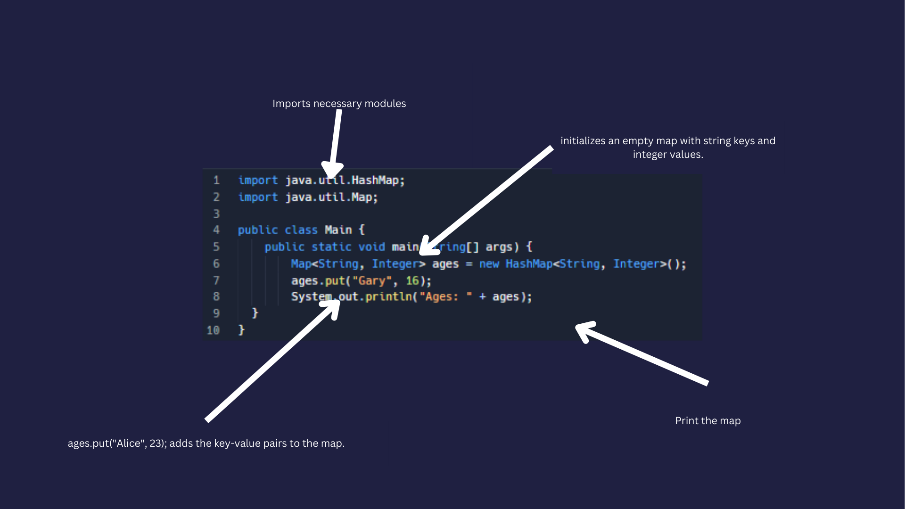

# Dictionaries

Dictionaries somtimes called Maps is simple keys with values meaning by called one item you can call another. 

Btw dictionarie has curly barket {} while a list has Square brackets []. 



👉 Type this line of code in `Main.java` and click `run`. 

```java
import java.util.HashMap;
import java.util.Map;

public class Main {
    public static void main(String[] args) {
        // Create a dictionaries with String keys and Integer values
        Map<String, Integer> ages = new HashMap<String, Integer>();

        // Add key-value pairs to the map
        ages.put("Gary", 16);
        ages.put("Bob", 25);
        ages.put("Joe", 20);

        // Print the map
        System.out.println("Ages: " + ages);

        // Access a value of a key
        int ageOfBob = ages.get("Bob");
        System.out.println("Bob's age is: " + ageOfBob);
    }
}

```

When removing a key and value you just need to remove the key, you can also iterate thorught the dictionaries

```java
import java.util.HashMap;
import java.util.Map;

public class Main {
    public static void main(String[] args) {
        Map<String, Integer> ages = new HashMap<String, Integer>();
        ages.put("Gary", 16);
        ages.put("Bob", 25);
        ages.put("Joe", 20);
        System.out.println("Ages: " + ages);


        // Remove a key-value pair from the map
        ages.remove("Alice");
        System.out.println("Ages after removal: " + ages);

        // Iterate through the dictionaries
        System.out.println("Iterating through the map:");
        for (Map.Entry<String, Integer> entry : ages.entrySet()) {
            System.out.println(entry.getKey() + ": " + entry.getValue());
        }
    }
}

```
